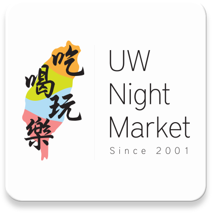
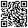
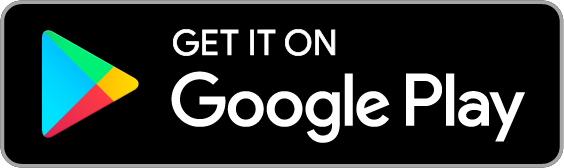
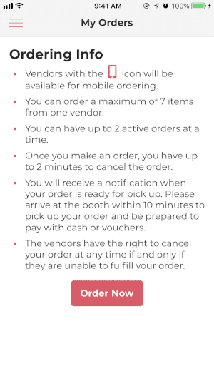
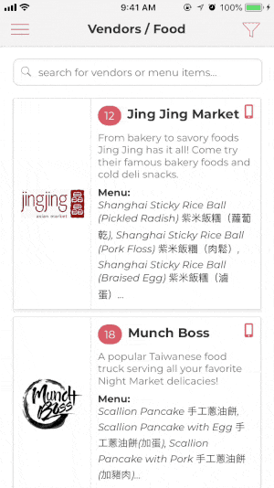
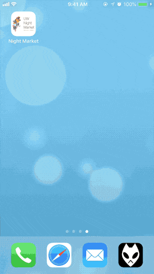

    

## Table of Contents
1. [Overview](#overview)
2. [Download](#download)
3. [Feature Showcase](#features)
4. [Technology Stack](#stack)
5. [The Team](#team)
6. [License](#license)

## Overview
The UW Night Market mobile application alleviates long wait line issues that plague popular food festivals. Leveraging a mobile ordering system to facilitate the ordering process between attendees and vendors, the application increases attendee satisfaction and vendor sales. During the UW Night Market event on May 12th, 2018, the application completed 483 orders and generated $4,553 in revenue for ten vendors in four hours.

The mobile application was built as the UW Night Market App team's iSchool capstone project for 2018.

[Project website](https://kchen73.github.io/uwnightmarket/) | [Documentation for developers](https://github.com/jacobdevera/uwnightmarket-app/tree/master/documentation)

## Download

    
     
     
    
     
     
    

## Feature Showcase

### Searching and Filtering Vendors

### Ordering

### Notifications and Order Pickup

## Technology Stack
### Development Framework: React Native
**React Native** is a development framework provided by Facebook as a solution to building native iOS and Android apps using JavaScript, utilizing the same patterns found in React. The UW Night Market App makes extensive use of its built-in APIs as well as a number of other libraries that provide additional functionality. Extensive testing was done to ensure that the app provided a consistent user experience across both versions while maintaining the design language of their respective platforms.
- UI Components: [native-base](https://github.com/GeekyAnts/NativeBase)
- Routing: [react-navigation](https://github.com/react-navigation/react-navigation)
- Maps: [react-native-maps](https://github.com/react-community/react-native-maps)
- Firebase Cloud Messaging: [react-native-fcm](https://github.com/evollu/react-native-fcm)

### Database and Authentication: Firebase
**Firebase** is a mobile and web application development platform provided by Google. The UW Night Market App makes use of its **realtime database** to store all orders, vendor information, and event status. **Firebase Cloud Messaging** is also used as a solution to send push notifications to attendees when the status of their order is updated or when an important announcement needs to be made during the event.

## The Team
### Kevin Chen
Project Manager | [LinkedIn](https://www.linkedin.com/in/kchen73/)
### Joyce Deng
UX Designer | [LinkedIn](https://www.linkedin.com/in/joycekdeng/)
### Jacob Devera
Software Developer | [LinkedIn](https://www.linkedin.com/in/jacobdevera/)
### Zhaoyang Yi
Software Developer | [LinkedIn](https://www.linkedin.com/in/zhaoyang-yi/)

## License
[MIT](https://github.com/jacobdevera/uwnightmarket-app/blob/master/LICENSE)